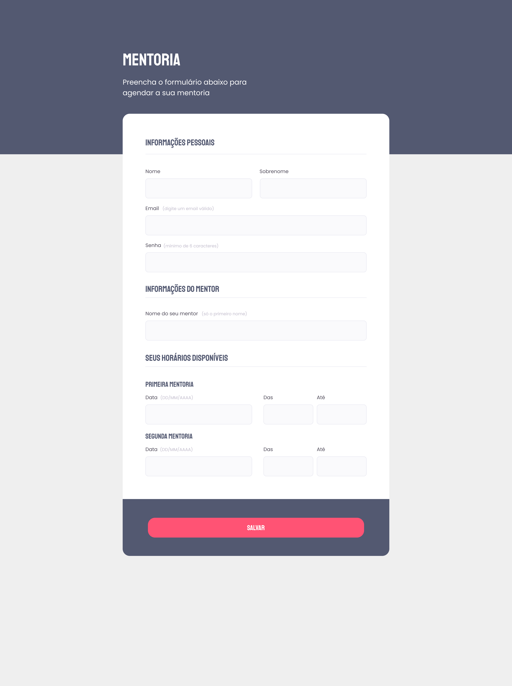

# Explorer Bonus Challenge 3

## Overview

**Explorer Bonus Challenge 3** is a dynamic and comprehensive repository designed for both beginners and intermediate web developers. This project aims to deepen participants' understanding of HTML and CSS through a series of thoughtfully crafted challenges. Covering a wide range of essential web development topics, it offers an interactive, hands-on learning experience. <br><br>
You can view the design inspiration here: [Figma Design](https://www.figma.com/file/Nws1KWB7DyXBw8L6wXb9mp/Stage-03---Formul%C3%A1rio-intermedi%C3%A1rio/duplicate).

## Project Preview

  
_Preview of the web page developed in this project._

## Project Structure

The project consists of two main files:

- `index.html`: This file contains the HTML structure of the project. It's where the core content and layout of the web page are defined.
- `style.css`: This file is responsible for the styling of the web page. It includes CSS rules that dictate the look and feel of the HTML elements.

Both files are carefully crafted to demonstrate best practices in web development, offering a practical insight into the creation of modern web pages.

## How to Clone the Project

To get started with this project, you will need to clone it from GitHub. Here’s how you can do it:

1. Open your terminal or command prompt.
2. Navigate to the directory where you want to clone the project.
3. Run the following command:

   ```
   git clone https://github.com/giovannivicentin/explorer-bonus-challenge-3
   ```

This command will create a local copy of the project on your machine.

## Getting Started with the Project

After cloning the project, you can start exploring the files. Open the `index.html` file in a web browser to see the project in action. Feel free to modify the HTML and CSS files to experiment with different designs and layouts.
